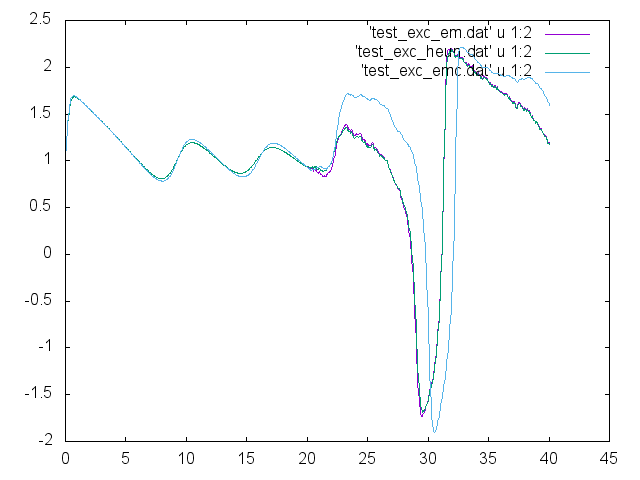

# SDDEKit 


## What is SDDEKit?

A library for stochastic delay differential equations implementing published
numerical schemes, utilities for constructing network models and handling
simulation results, as well as bindings for MATLAB, Python.  Our intent is
to make it possible to use and benchmark available schemes on your favorite
model, not invent new numerical schemes, so we have attempted to follow
[published results](#references), documenting caveats, assumptions etc. Care will be taken to
handle calculation of partial erivatives, to enable higher order schemes,
optimization and inversion techniques.

*The current focus is nailing down 'software carpentry' aspects of building a scientific library, and only preliminary sets of mathematical components are implemented, not for use pending v0.1 release, though I have stopped ruthless rebasing of master so it's safe to fork*.

## Using

Currently the [documentation](https://maedoc.github.io/sddekit),
[tests](tests) and [benchmark](bench/bench_net_exc.c) are the best places 
to look to understand what you can do with SDDEKit.

Python, MATLAB bindings and C++ header are in the works, on separate 
(`ctype`/`cython`/`py-c-api`, `matlab`, `cpp` respectively) branches of
this repo.

You can build the tests and benchmark if you have GCC (or a C99 compiler) and Make:

```bash
$ make tests
...
$ make bench_net_exc 
...
```

Running the tests will generate some data files from [one of the tests](test/test_exc.c), which
tests different integration schemes on the same system. These can be compared with
the gnuplot script `fig/exc_em_emcolor_heun.gpi`

```bash
$ gnuplot fig/exc_em_emcolor_heun.gpi
```

which produces 



Running the benchmark will produce a trace `bench_net_exc.dat` which can be visualized
with `fig/bench_net_exc.py`, producing


As stated, these are in place to help build up the library at this point. In the
future extensive examples for different kinds of systems & networks will be provided.

## js

Because SDDEKit is a C library, it's straighforward to build it as a JavaScript
library and embed it in HTML with Emscripten. With the benchmark mentioned above
as an example, compile it natively,

```bash
$ make BUILD=fast -B -j bench_net_exc
...
$ ./bench_net_exc
[bench_net_exc] nnz=1560
[INFO] bench/bench_net_exc.c:71 (main) continuation required 23.766 s
```

A little slow on this 2009 Core 2 Duo laptop. Now, with 
the [Emscripten SDK installed](http://kripken.github.io/emscripten-site/docs/getting_started/downloads.html),
build an HTML page that runs the benchmark in your browser:

```bash
$ make CC=emcc BUILD=js OBJEXT=bc EXE=.html -B -j bench_net_exc.html
...
```

Open [`bench_net_exc.html`](http://rawgit.com/maedoc/sddekit/js-bench-html/bench_net_exc.html)
 with your browser. On this same machine, Safari
runs the benchmark in 74 s, Firefox 55 s. On a win 10 workstation,
Firefox takes 32 s & MS Edge 39 s.

Obviously for high-performance computing & science JS isn't ideal, but it could
be useful for creating interactive graphics exploring dynamical systems.

## Develop

Fork the code, try it out. See our documented [issues](issues) or
add your own.

### Contributing

Please follow the generic GitHub workflow:

- fork the repo
- create a topic branch, e.g add-foo-implementation
- make modifications
- git commit -m 'useful comments'
- push branch to your fork on GitHub
- open pull request

[Here's way more detail w/ pictures](https://guides.github.com/introduction/flow/index.html)

### Python wrapper

The current work on Python wrapper in the `ctype` branch follows the naming conventions
of the C library for the moment, drastically reducing the code required to use it. Though
if time permits, the API could be Python-ized.

### C lib architecture

To keep things general, most high-level components are exposed as interfaces through
structs whose fields are just function pointers.

Contributing an implementation of a particular interface therefore implies

- writing implementations for each of the members of the interface struct
- writing a constructor function which
  - alloc with sd_malloc
  - fill out interface struct
  - return it
- document & test

Keep in mind that if you 'subclass' an existing interface, some methods like
`free` should be available (and correctly implemented) in both

## References

- Kloeden & Platen 1999 *Numerical Solution of Stochastic Differential Equations*.
- Fox et al 1998
- Mannella 200?
- Jimenez et al 2015
- Kuechler & Platen 2000
